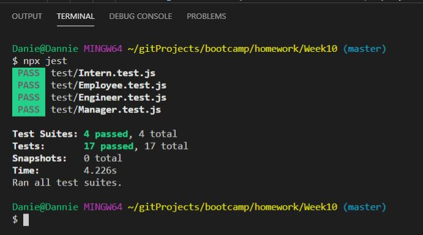
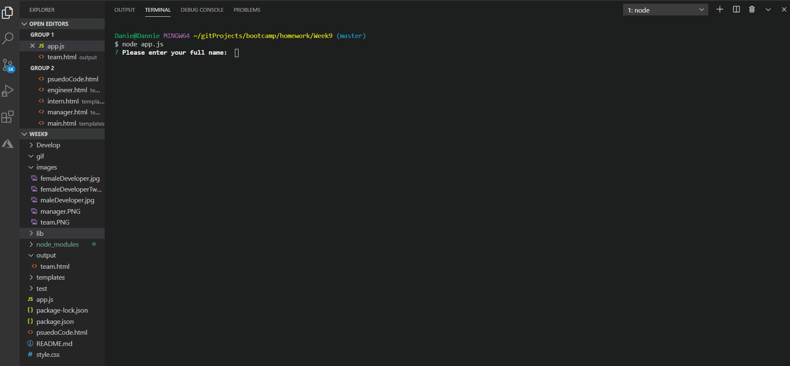
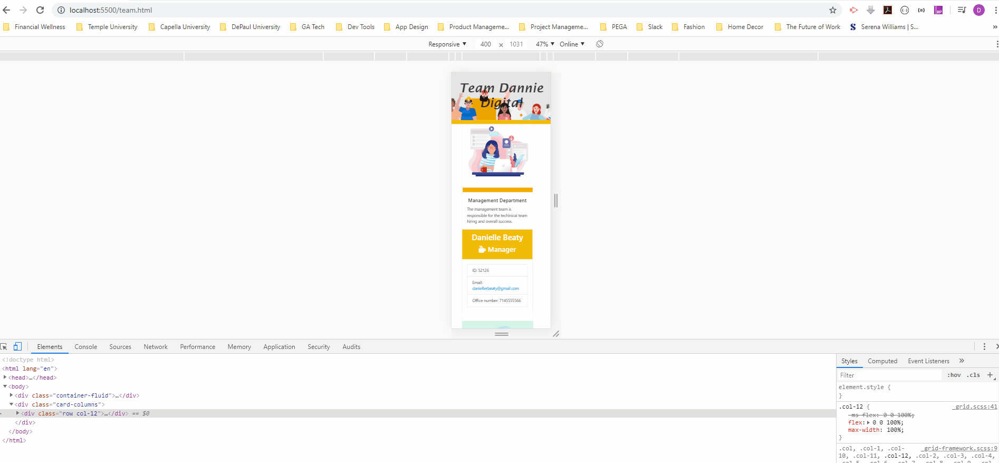
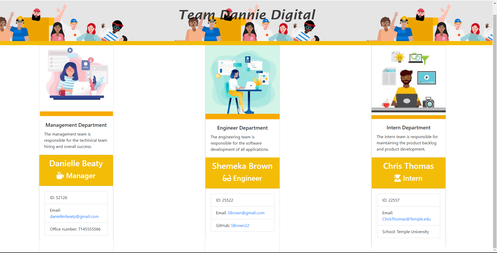

## Employee Directory Generator 
 
 
  
  
### DanielleRBeaty@gmail.com

---
### Description
###### As a manager, I want to generate a webpage that displays my team's basic infoso that I have quick access to emails and GitHub profiles
---
## Table of contents
* [About](#about)
* [How to Use](#how-to-Use)
* [Licenses](#Licenses)
* [Contributors](#Contributors)
* [Tests](#Tests)
* [Questions](#Questions)
* [App Functionality](#App-Fuctionality)
* [Application](#application)
---
### About
###### The employee generator will provide managers the ability to add new employees by input and view all entries via the web application.
---
### How to Use
###### 1. Run app as a Node CLI to gather information about each employee
---
### Licenses
###### None
---
### Contributors
###### Danielle Beaty
---
### Tests
###### Jest

---
### Any Questions?
###### Please email contributors
---
### App Functionality

---
### Application

